

<h1>🏁 UIC FSAE Exhaust System Data</h1>
<h3>Team 30 Powertrain Engineering Dashboard</h3>
<i>Interactive simulation telemetry and Finite Element Analysis (FEA) data for the UIC FSAE 4-2-1 Exhaust System.</i>

## 👨‍💻 Meet the Team

*Click our names to connect with us on LinkedIn!*

| [**Jacob Schifrin**](https://www.linkedin.com/in/jacobschifrin) | [**Aiden Avalos**](https://www.linkedin.com/in/aiden-avalos-279285220/) | [**Michal Potok**](https://www.linkedin.com/in/michal-potok-86bb84227/) | [**Eduardo Escobar**](https://www.linkedin.com/in/eduardo-escobar-1469ba21a/) | [**Thomas Dicke**](https://www.linkedin.com/in/thomas-dicke-93599524b/) |

## ⚙️ 1D Simulation Model Setup (Ricardo WAVE)

*The foundation of the exhaust design relies on a complete one-dimensional acoustic and thermodynamic model of the Honda CBR600 engine. The following diagrams detail the specific system components and boundary conditions configured prior to optimization.*

<b>🛠️ Full Engine Topology</b> <i>(Click to Collapse)</i>

 <i>Complete 1D engine topology mapping the intake restrictor, engine block, 4-2-1 exhaust routing, and simulated muffler.</i>

<b>🔍 Sub-System Configurations</b> <i>(Click to Expand)</i>

<table>
<tr>
<td align="center"><b>Intake & ITB Flow</b> 
 
<i>Intake restrictor and equivalent individual throttle body (ITB) flow area approximation.</i></td>

<td align="center"><b>Exhaust Collectors</b> 
 
<i>Exhaust 4-2-1 primary pipe pairing and collector junction topology.</i></td>

<td align="center"><b>Muffler Capacitance</b> 
 
<i>Helmholtz resonator geometry simulating physical muffler capacitance and flow resistance.</i></td>
</tr>
</table>

## 📊 Interactive Telemetry Dashboards

*Experience our data live. Tap the links below to interact with the 3D models and custom charting tools.*

* 🚀 [**Phase 1: Acoustic Length Optimization Heatmap**](Length%20Simulation%20Results.html)

* 📈 [**Phase 2: Final Geometry Performance Data**](Design%20Comparison%20Charts.html)

## 🔬 Finite Element Analysis (FEA) Validations

*Select a category below to expand and view the Fluent analysis data. This data displays exhaust gas velocity, temperature, pressure, and turbulence through the 4-2-1 merges.*

<b>💨 Velocity & Streamlines</b> <i>(Click to Expand)</i>

<table>
<tr>
<td align="center"><b>Velocity Vector SS</b>

</td>
<td align="center"><b>Velocity Vector BACK SS</b>

</td>
</tr>
<tr>
<td align="center"><b>Streamline Velocity SS</b>

</td>
<td align="center"><b>Streamline Velocity BACK SS</b>

</td>
</tr>
</table>

<b>⏱️ Pressure Analysis</b> <i>(Click to Expand)</i>

<table>
<tr>
<td align="center"><b>Pressure Wall SS</b>

</td>
<td align="center"><b>Pressure Wall BACK SS</b>

</td>
</tr>
</table>

<b>🌡️ Temperature Distribution</b> <i>(Click to Expand)</i>

<table>
<tr>
<td align="center"><b>Temperature Wall SS</b>

</td>
<td align="center"><b>Temperature Wall BACK SS</b>

</td>
</tr>
</table>

<b>🌪️ Turbulence Analysis</b> <i>(Click to Expand)</i>

<table>
<tr>
<td align="center"><b>Turbulence SS</b>

</td>
<td align="center"><b>Turbulence BACK SS</b>

</td>
</tr>
</table>

<b>🏗️ Structural Analysis</b> <i>(Click to Expand)</i>

<table>
<tr>
<td align="center"><b>Equivalent Stress Front</b>

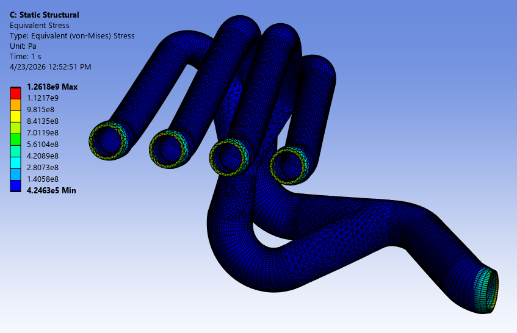</td>
<td align="center"><b>Equivalent Stress Back</b>

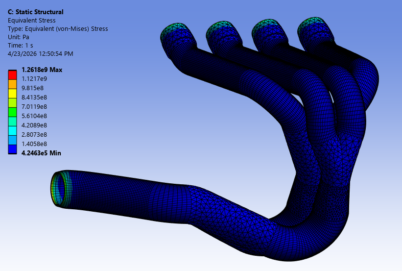</td>
</tr>
<tr>
<td align="center"><b>Safety Factor Front</b>

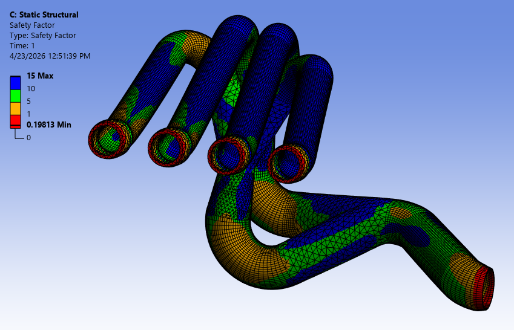</td>
<td align="center"><b>Safety Factor Back</b>

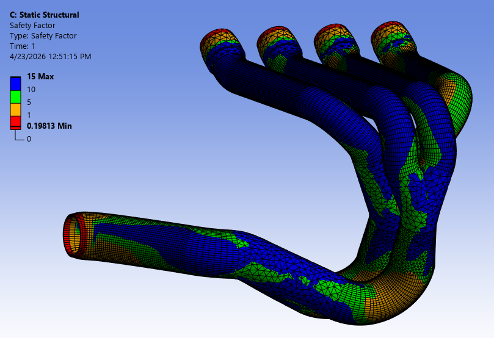</td>
</tr>
<tr>
<td align="center"><b>Total Deformation Front</b>

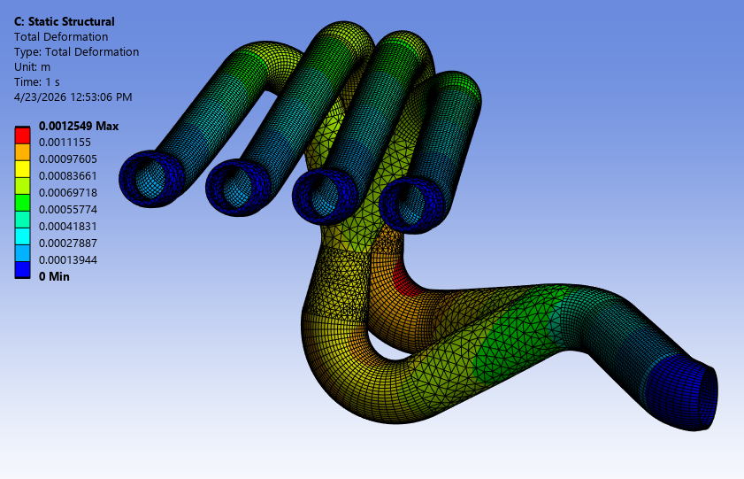</td>
<td align="center"><b>Total Deformation Back</b>

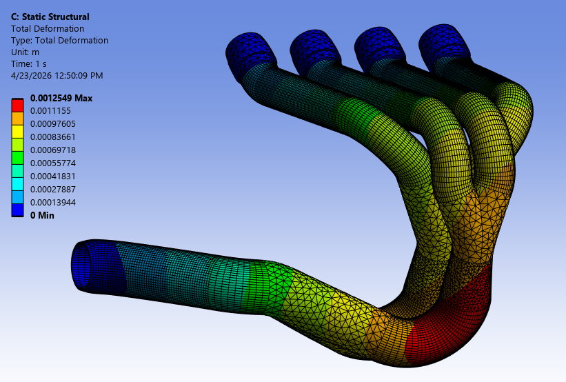</td>
</tr>
</table>

<b>🔥 Thermal Analysis</b> <i>(Click to Expand)</i>

<table>
<tr>
<td align="center"><b>Heat Flux Front</b>

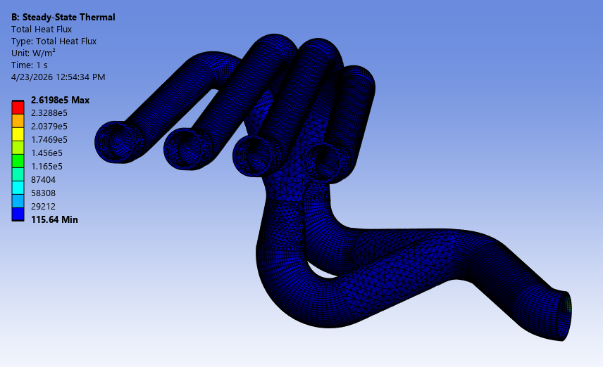</td>
<td align="center"><b>Heat Flux Back</b>

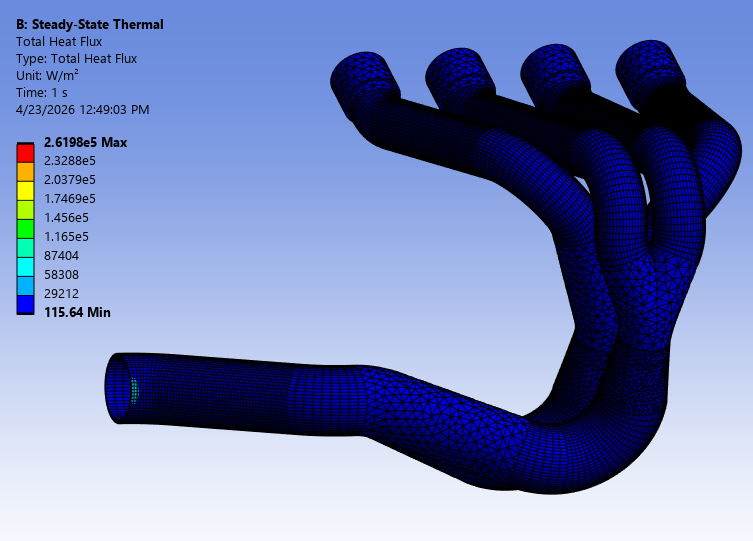</td>
</tr>
<tr>
<td align="center"><b>Temperature Front</b>

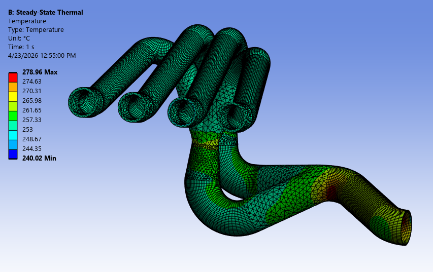</td>
<td align="center"><b>Temperature Back</b>

</td>
</tr>
<tr>
<td align="center"><b>Thermal Error Front</b>

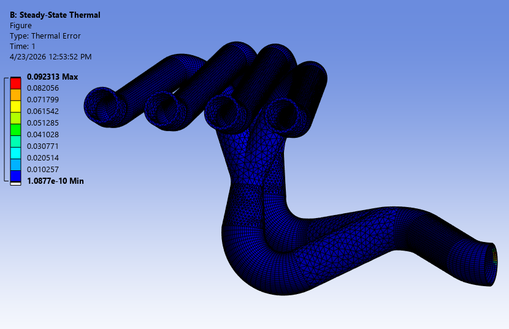</td>
<td align="center"><b>Thermal Error Back</b>

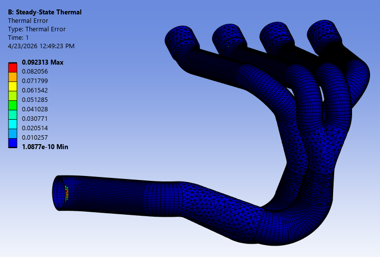</td>
</tr>
</table>

<i>University of Illinois Chicago (UIC) • MIE 397 Senior Design Expo</i>

